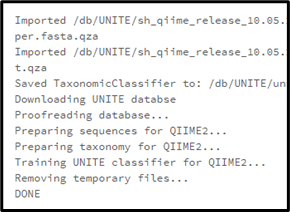
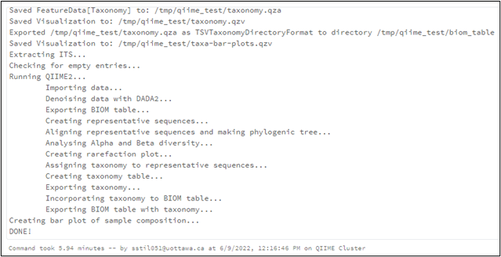
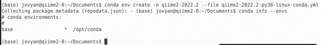
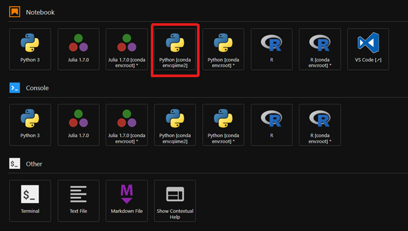

# **Bioinformatics Pipeline Evaluation**

- [**Bioinformatics Pipeline Evaluation**](#bioinformatics-pipeline-evaluation)
  - [**Results**](#results)
  - [**Takeaways**](#takeaways)
  - [**QIIME2**](#qiime2)
    - [**Databricks**](#databricks)
      - [Troubleshooting](#troubleshooting)
      - [Performance Evaluation](#performance-evaluation)
      - [Additional Work](#additional-work)
      - [Results and Takeaways](#results-and-takeaways)
    - [**Replicating on AAW**](#replicating-on-aaw)
      - [Remote Desktop environment](#remote-desktop-environment)
      - [Notebook environment](#notebook-environment)
      - [Pipeline environment](#pipeline-environment)
  - [**ATLAS**](#atlas)
    - [**Databricks**](#databricks-1)
      - [Troubleshooting](#troubleshooting-1)
    - [**Replicating on AAW**](#replicating-on-aaw-1)

## **Results**

We attempted to run bioinformatics pipelines using QIIME2 and Metagenome-ATLAS on several different platforms. The work completed is described here for each of the tools. 

We were forced to use the Shell to successfully run QIIME2 in Databricks as there is no way to change what conda environment a notebook uses.

We were not able to completely run the ATLAS pipeline in Databricks.

We were unable to run the sample pipeline provided in the tutorial in its entirety on Databricks. While ATLAS appears to be fully installed and setup properly using our script, we encounter a bug towards the end of execution that prevents us from finishing. 

While it seems possible to run an ATLAS pipeline in Databricks, we also encounter some of the same challenges as with QIIME2, as we were not able to set up and activate a conda environment within the cells.

As for the exploration work done in the StatCan AAW platform: we were able to run QIIME2 in their Kubeflow environment but were not able to make full use of the cluster as it is required to use the Kubeflow pipeline to fully make use.

Running ATLAS in the Kubeflow environment was unsuccessful as we ran into several problems. These problems had not been encountered by others online and very little documentation exists on how to fix them

## **Takeaways**

- Databricks provides an interface closer to cluster ressources allowing users to make full use of resources easier (with the use of Spark). On the other hand, Databricks

## **QIIME2**

We found that replicating QIIME in StatCan’s platform was slightly difficult due to issues with conda environments. These issues seem to have been tied with package installation/JFROG XRAY and were fixed after contacting the StatCan AAW team on Slack. On the other hand, a few features found on AAW seemed quite useful in the context of deploying pipelines. One such feature is the creation of notebooks from within an existing conda environment.

We successfully ran the QIIME pipeline in Databricks by using Shell commands within cells to run it. This is because Databricks does not allow us to activate a conda environment, meaning we are unable to fully leverage notebooks on Databricks. StatCan's platform allows us to start notebooks with a different environment.

### **Databricks**

#### Troubleshooting

We met with Guillaume to discuss what his issue was. He was running into an issue with the ITS training script as well as the actual pipeline. We were able to replicate these issues on our end as well. 

Once we were able to replicate the issues, we worked on the QIIME Setup v2 script. We were able to resolve the issue with it by modifying some of the paths, and this script could then run fully, as shown below:



We then worked on the QIIME_ITS_run script. The first error encountered was an issue with the data provided, as empty values were not being removed from the fastq entries. There was a script failing to run to remove these empty values, but it was not being properly found.

 - Problem: `[Errno 2] No such file or directory for remove_empty_fastq_entries.py`
 - Cause: Program was looking in the root directory (with /remote_empty_fastq_entries.py) rather than locally.
 - Solution: Copy the script to the root with cp remove_empty_fastq_entries.py /remove_empty_fastq_entries.py. In the future, this should be resolved in the code.
  
There were additional issues regarding writing files needed for the pipeline to run. , so setting the output folder to mounted storage would cause an `OSError: [Errno 95] Operation not supported error`.

 - Problem: `OSError: [Errno 95] Operation not supported when attempting to write to the mounted storage. Failing to write also causes [Errno 2] No such file or directory since those files cannot be read later in the program.`
 - Cause: Databricks does not support writing to mounted storage.
 - Solution: Create a local directory (in our case, /tmp/qiime_test) that the pipeline can write to instead of mounted storage. Pass that as the output directory using -o /tmp/qiime_test in the call to Python. This resolves all errors.

With these errors solved, the pipeline runs properly and can be evaluated, as shown below:



#### Performance Evaluation
After successfully running the program, we wanted to evaluate the performance on the Databricks cluster. To do this, we started by following the code performance measurement guide here: Python Code Performance Measurement – Measure the right metric to optimize better!

We placed the starting blocks prior to running the script, then the ending blocks immediately after. We obtained the following results:

```
Peak Size in MB -  0.23340892791748047
Time elapsed: 356474.1015434265 milli seconds
```

These results can be compared by running the same code elsewhere.

#### Additional Work

We attempted to determine if QIIME2 could be added to the existing environment on Databricks. This would allow us to create notebooks that directly use QIIME2, rather than having to use shell commands to do so. 

We followed the instructions at https://docs.qiime2.org/2022.2/install/native/ to attempt the installation. This was unsuccessful, as **[conda env create and conda activate are not supported on Databricks](https://databricks.com/blog/2020/06/17/simplify-python-environment-management-on-databricks-runtime-for-machine-learning-using-pip-and-conda.html)**. Attempting to do so results in `ValueError: conda activate is not supported in Databricks.`

We also attempted the following methods to add QIIME2:

| Command | Result |
| ---     | ---    |
| `%conda env update --file qiime2_2022_4_py38_linux_conda.yml --prune` | `CalledProcessError: Command 'conda env update -p /local_disk0/.ephemeral_nfs/envs/pythonEnv-caed3ba9-87f4-4939-a9dd-a6b06d8675db --file qiime2_2022_4_py38_linux_conda.yml --prune' returned non-zero exit status 1.` |
| `!conda env update --file qiime2_2022_4_py38_linux_conda.yml --prune` | Runs without error, produces no output but does not allow `import qiime2` to be run.
| `!conda install -c qiime2 qiime2` | Runs without error, produces no output but does not allow `import qiime2` to be run. |

We were unable to directly add QIIME2 to the Databricks Conda environment. So far, the only way we can successfully use QIIME2 is by using the `%sh` command in a notebook cell to run the Shell commands needed to do so.

#### Results and Takeaways

While we were successful in running a QIIME2 pipeline, we were not able to leverage Databricks notebooks to do so. This is because setting up QIIME2 requires setting up and activating an Anaconda environment, which is not currently possible on Databricks.

The only way we were able to run the pipeline is by using the `%sh` command in a notebook cell in order to run the Shell commands necessary to setup and run QIIME2.

### **Replicating on AAW**

#### Remote Desktop environment
I have found the process of replicating this pipeline on StatCan’s platform to be slightly hard. The near necessity of using terminal forced me to use a remote desktop instead of a notebook. In the remote desktop, I have been encountering a lot of issues with setting up the proper QIIME2 environment:



In the first line, I create the environment from the already downloaded yml file but the process stops without completing and without throwing any errors either. Looking at `conda info --envs` shows that the environment was not properly created.
When meeting with Guillaume, he said that he encountered the exact same issue and that he had given up setting up the pipeline on StatCans platform.
This was afterwards fixed at the same time the JFROG XRAY issues were fixed (mentioned in the Notebook environment section).
From this point onward, the pipeline can be run in the Desktop environment and performance is identical to the Notebook environment.

#### Notebook environment

My goal in the notebook was to recreate the “Moving Pictures” tutorial from QIIME. Once I have done the preliminary work of getting the qiime2 conda environment setup, I tried running
```
qiime tools import --type EMPSingleEndSequences --input-path emp-single-end-sequences --output-path emp-single-end-sequences.qza
```

Which led to the same issue as we had when trying to run the pipeline on Databricks:

```
Traceback (most recent call last):
  File "/opt/conda/envs/qiime2/lib/python3.8/site-packages/qiime2/core/archive/archiver.py", line 180, in save
    zf.write(str(abspath), arcname=cls._as_zip_path(relpath))
  File "/opt/conda/envs/qiime2/lib/python3.8/zipfile.py", line 1776, in write
    shutil.copyfileobj(src, dest, 1024*8)
  File "/opt/conda/envs/qiime2/lib/python3.8/zipfile.py", line 1182, in close
    self._fileobj.seek(self._zipfile.start_dir)
OSError: [Errno 95] Operation not supported
```

The issue was with mounted storage: it seems you cannot write inside of mounted storage (from either StatCan’s AAW or Databricks) which causes this issue. This was fixed by writing the output to a folder outside of the mounted storage.

Next we ran into the following issues:

`'itsxpress' is not a valid file/folder`

And:
```
Plugin error from dada2:

  An error was encountered while running DADA2 in R (return code 1), please inspect stdout and stderr to learn more.

Debug info has been saved to /tmp/qiime2-q2cli-err-egwl88sf.log
There was an issue with loading the file /home/jovyan/qiime_test/stats.qza as metadata:

  Metadata file path doesn't exist, or the path points to something other than a file. Please check that the path exists, has read permissions, and points to a regular file (not a directory): /home/jovyan/qiime_test/stats.qza

  There may be more errors present in the metadata file. To get a full report, sample/feature metadata files can be validated with Keemei: https://keemei.qiime2.org

  Find details on QIIME 2 metadata requirements here: https://docs.qiime2.org/2022.2/tutorials/metadata/
```

These two issues are seemingly caused by installation errors with conda. I contacted people from StatCan’s AAW team on Slack to get some insight on how to fix these. I decided to restart the conda environment from scratch, as recently the StatCan team had been messing with jfrog security and it may have messed with my conda environment dependencies. Creating a new environment now results in python not recognizing the QIIME conda environment at all:

```
Traceback (most recent call last):
  File "qiime2_its.py", line 399, in <module>
    Qiime2(arguments)
  File "qiime2_its.py", line 59, in __init__
    self.run()
  File "qiime2_its.py", line 66, in run
    self.checks()
  File "qiime2_its.py", line 243, in checks
    raise Exception('You must activate your QIIME2 conda environment to run this script. '
Exception: You must activate your QIIME2 conda environment to run this script. "conda activate qiime2-2020.8"
```

Since then I have been looking at using QIIME without conda.
I contacted the AAW team on Slack but I was afterward able to find a solution: completely deleting my environment and restarting from scratch a third time in a row has the pipeline fully working. By this, I mean that the environment was fully created correctly and that the pipeline itself recognized all the tools. This seems to be confirming my idea that these issues were linked to package installment issues.

In order to test the performance, I ran the metrics tool when running the pipeline after escaping to bash and obtained results identical to those obtained when running from Databricks (perhaps the metrics tools we are using are not well adapted). 

After, I was able to create a new notebook from within the python conda environment. This is a feature that is not available on Databricks and may be extremely useful in our context.



From this notebook, I was able to run the pipeline without escaping to shell. I ran the metrics tools when doing so, which resulted in the same results than when escaping to shell.

#### Pipeline environment

The Kubeflow pipeline environment is an advanced tool and it should be considered only in cases where users want to push the optimization of their process to the max.

At this stage, I put a focus on trying to create a pipeline that estimates the value of pi using python. I wanted to use this pipeline to leverage the parallelization of containers. For this I used the following ressources:
- Approach 1 of [Calculating pi with python](https://www.geeksforgeeks.org/calculate-pi-with-python/)
- [Build a Pipeline](https://www.kubeflow.org/docs/components/pipelines/sdk/build-pipeline/)
- [Building Components](https://www.kubeflow.org/docs/components/pipelines/sdk/component-development/)
- [Building Python function-based components](https://www.kubeflow.org/docs/components/pipelines/sdk/python-function-components/)

This work and exploration is currently put on pause: a lot of difficulties were encountered when learning how to use this environment due to the lack/low quality of documentation.

## **ATLAS**

We were unable to successfully run an ATLAS pipeline in its entirety. We followed [a tutorial with samples](https://metagenome-atlas.readthedocs.io/en/latest/usage/getting_started.html#install-metagenome-atlas) but encountered a variety of errors. In Databricks, we encountered some of the same challenges as with QIIME2, as we were not able to set up and activate a conda environment within the cells.

### **Databricks**

#### Troubleshooting

To demonstrate the use of ATLAS on Databricks, I followed this tutorial: https://metagenome-atlas.readthedocs.io/en/latest/usage/getting_started.html#install-metagenome-atlas

The tutorial provides sample files to perform basic analysis. I used the following code, most of which was provided in this installation:

```
%sh
conda config --add channels defaults
conda config --add channels bioconda
conda config --add channels conda-forge
conda install mamba
mamba create -y -n atlasenv metagenome-atlas=2.9
source activate atlasenv
mkdir /tmp/atlas
cd /tmp/atlas
wget https://zenodo.org/record/3992790/files/test_reads.tar.gz
tar -xzf test_reads.tar.gz
atlas init --db-dir databases /tmp/atlas/test_reads
atlas run None --resources mem=128 --keep-going --latency-wait=30
```

I encountered several issues while doing this, such as:

 - Problem: `There is insufficient memory for the Java Runtime Environment to continue.`
 - Cause: Cluster has too little memory to run Atlas.
 - Solution: We increased the memory on the cluster, which prevented this error.

I also encountered severe latency using the suggested instructions. This was especially problematic as the script would crash anyways, taking me 3-4 hours to learn of a new failure. This was resolved by changing atlas run genome to atlas run None which only took half an hour to an hour.

This allowed faster troubleshooting, but there were still additional issues.

 - Problem: `Missing files after 5 seconds.`
 - Cause: Most likely file system latency.
 - Solution: Adding the `–latency-wait` tag to tolerate more latency. https://github.com/snakemake/snakemake/issues/1734 recommends 30 seconds.

Another problem was encountered near the end of execution:

 - Problem: `BUG: Out of jobs ready to be started, but not all files built yet`
 - Cause: Unknown. GitHub issue exists: https://github.com/snakemake/snakemake/issues/823 and https://github.com/snakemake/snakemake/issues/1687 
 - Solution: TBD

### **Replicating on AAW**

The work done was o

